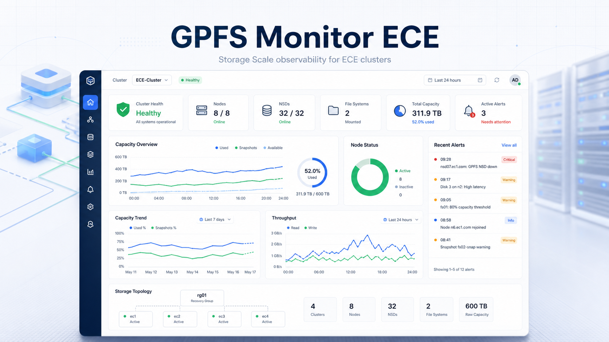
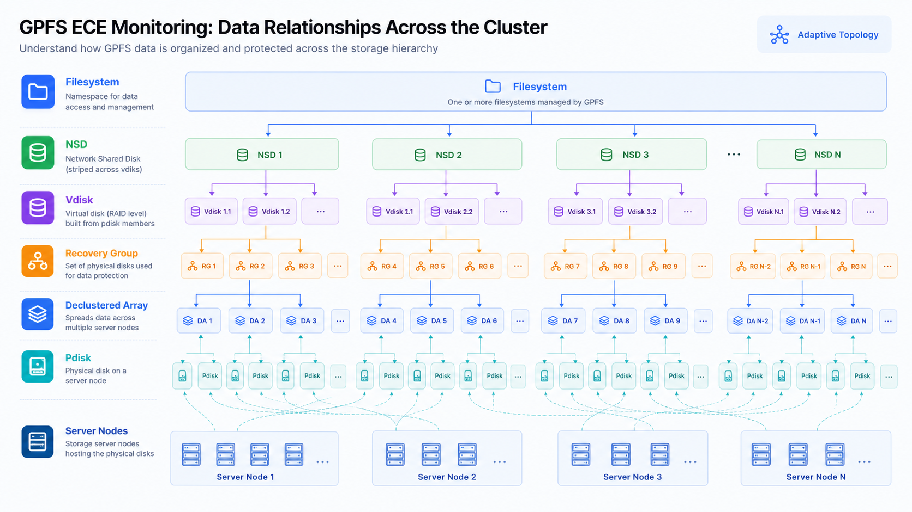
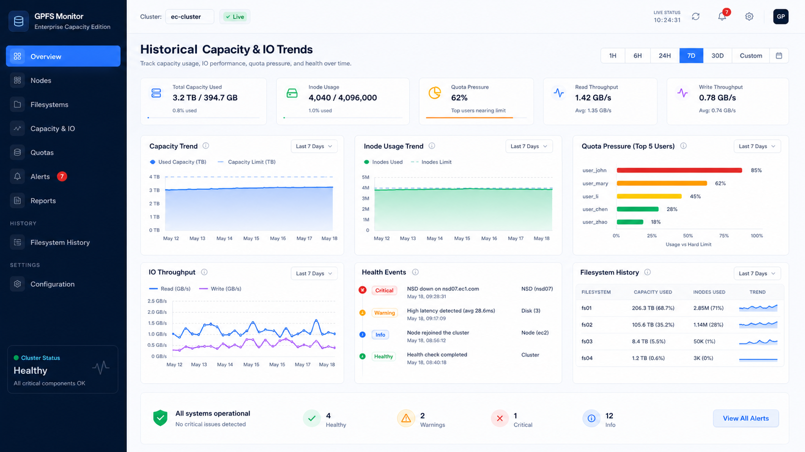

# GPFS Monitor ECE

面向 IBM Storage Scale / GPFS ECE 集群的可视化监控与运维观察平台。

GPFS Monitor ECE 的目标不是简单把命令行输出搬到网页上，而是把 GPFS ECE 集群中分散的节点、文件系统、NSD、vdisk、recovery group、declustered array、pdisk、quota、fileset、健康事件等信息组织成一个可理解、可巡检、可持续演进的运维视图。

对于日常运维来说，GPFS/ECE 的信息往往分布在多条命令、多种层级和不同对象之间。这个项目希望把这些关系整理成一套更直观的产品体验：让管理员可以快速判断集群是否健康、容量是否可控、Quota 是否逼近阈值、物理磁盘和虚拟磁盘之间的映射是否清晰，以及故障或异常应该从哪个层级开始定位。

## 项目定位

GPFS Monitor ECE 是一个轻量级的 GPFS 集群观察台，重点覆盖 ECE 场景下的存储拓扑、容量、配额、文件集、健康状态和告警事件。

它适合用于：

- GPFS / IBM Storage Scale 集群状态巡检
- ECE 模式下 recovery group、declustered array、pdisk、vdisk 的关系梳理
- 文件系统容量、inode、NSD、磁盘状态的集中展示
- 用户、用户组、fileset quota 使用情况观察
- 健康事件、异常状态和告警通知的统一入口
- 面向后续历史趋势、容量预测、IO 性能分析的基础平台

## 已实现能力

### 集群总览

提供面向运维人员的 Dashboard 视图，集中展示节点数量、NSD 数量、文件系统、容量使用、inode 使用、健康状态、告警事件等关键指标。

它的设计目标是让管理员打开页面后先回答三个问题：

- 集群当前是否健康？
- 容量和 inode 是否有压力？
- 是否存在需要立即关注的异常？

### 物理与逻辑拓扑

项目已经支持 GPFS ECE 中多层对象关系的可视化理解，包括：

- Filesystem
- NSD
- Vdisk
- Recovery Group
- Declustered Array
- Pdisk
- Server Nodes

在 ECE 集群中，生产环境可能不是 4 台 server 节点，而是几十台甚至上百台 server 节点，并且存在多个 RG、多个 DA、多个 vdisk、多个 NSD 和多个文件系统。项目的拓扑能力会持续向“大规模集群自适应展示”演进，重点解决数量增多后的分组、筛选、折叠、聚合和关系追踪问题。

### 节点与健康状态

Cluster Nodes 页面用于展示节点状态、quorum、GPFS membership 等信息，并支持节点详情查看。Health Status 页面将 GPFS 健康检查结果进行归纳，让异常组件、失败状态、降级状态更容易被发现。

Event Logs 页面并不是简单展示所有正常巡检记录，而是聚焦异常事件和告警历史。当前已覆盖集群健康、节点健康、NSD 磁盘状态、pdisk 状态等异常检测来源。

### NSD、磁盘、pdisk、vdisk 视图

项目对 GPFS 存储对象进行了拆分展示，便于从不同角度排查问题：

- GPFS NSDs：查看 NSD 与文件系统、服务节点、使用率之间的关系
- GPFS DISKs：查看文件系统磁盘状态、availability、metadata/data 属性、storage pool 等信息
- GPFS Pdisks：查看 ECE recovery group 下的物理磁盘状态
- GPFS Vdisks：查看 vdisk、DA、log group、RAID、capacity、activity 等信息

这些页面的目标是把 GPFS/ECE 的复杂对象关系从命令行输出转化成可检索、可筛选、可对照的运维数据表。

### Quota 与 Fileset 管理视图

GPFS Quotas 页面用于展示文件系统中的 quota 使用情况，支持从多个维度观察：

- 文件系统级 quota
- 用户 quota
- 用户组 quota
- 用户组成员 quota
- fileset / directory quota

GPFS Filesets 页面用于展示 fileset 状态、路径、inode space、inode 使用情况等信息，便于理解文件集在文件系统中的组织方式。

### Recovery Group 关系视图

Recovery Groups 页面用于集中理解 ECE 中核心保护单元之间的关系：

- recovery group
- declustered array
- pdisk
- vdisk
- NSD
- filesystem
- server node

该页面的价值在于帮助管理员从“文件系统看到的 NSD”一路追踪到“底层 ECE 保护组和物理磁盘”，让容量、保护、故障定位之间的关系更清楚。

### 历史趋势方向

容量使用、inode 使用、quota 压力、健康事件和 IO 性能趋势是后续重点增强方向。项目已经预留了向历史数据持久化和趋势分析演进的产品方向。

未来希望把当前的实时监控进一步升级为可回溯、可对比、可预测的运维分析平台，例如：

- 文件系统容量趋势
- inode 增长趋势
- quota 压力变化
- read / write IO 趋势
- 节点、磁盘、NSD 异常历史
- 容量增长预测与风险提醒

## 产品设计思路

这个项目的 UI 设计更偏向运维控制台，而不是普通管理后台。页面强调信息密度、状态可读性和对象关系，不追求花哨的视觉效果。

设计原则包括：

- 首页先看整体健康和风险
- Inventory 页面强调可搜索、可筛选、可导出
- 拓扑页面强调层级关系和规模适应
- 告警页面只突出异常，而不是堆积正常日志
- 配置页面用于快速理解集群关键参数
- 后续趋势页面用于从“当前状态”走向“历史判断”

## 当前状态

项目仍在持续开发中，当前已经具备基本的 GPFS/ECE 集群观测、拓扑、Quota、Fileset、Recovery Group 和健康事件能力。

后续会继续增强：

- 历史数据持久化
- 容量与 IO 趋势分析
- 更大规模集群拓扑自适应
- 告警规则配置
- 多文件系统对比
- 更完善的报表与导出能力
- 更多 GPFS / Storage Scale 运维场景支持

## 合作与反馈

更多功能持续开发中。

如果你也在使用 IBM Storage Scale / GPFS / ECE，或者希望基于这个项目定制更多监控、运维、告警、报表、拓扑或容量分析能力，欢迎留言交流。

也可以加 V：`jiaguangqi888`
